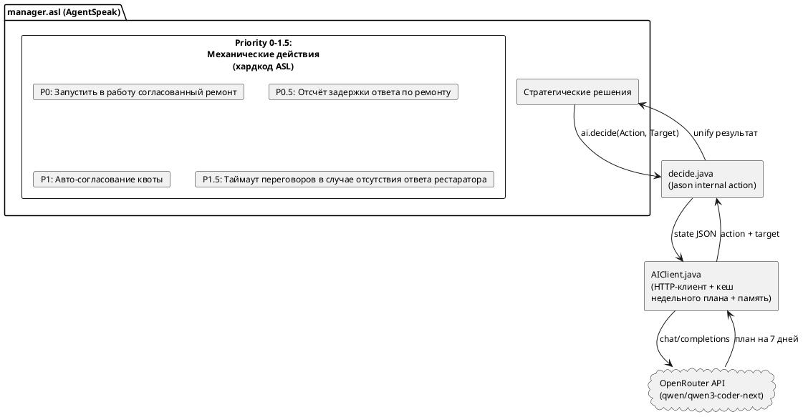

# Отчёт: AI-менеджер музейного комплекса через LLM (OpenRouter API)

## 1. Цель работы

Заменить хардкод-логику принятия решений агента-менеджера в мультиагентной симуляции музейного комплекса (платформа Jason/AgentSpeak) на вызовы LLM через OpenRouter API. Модель получает полное состояние симуляции в формате JSON, возвращает план действий, сохраняет контекст между шагами через conversation history.

## 2. Архитектура решения



### Созданные файлы

| Файл | Назначение |
|------|-----------|
| `src/java/ai/AIClient.java` | HTTP-клиент для OpenRouter, system prompt, кеш недельного плана, conversation memory |
| `src/java/ai/decide.java` | Jason internal action — извлекает belief base агента, конвертирует в JSON, вызывает AIClient |
| `src/agt/manager.asl` | Упрощённый агент: механические приоритеты + делегирование AI |

### Ключевые решения

- **Недельное планирование**: один API-вызов возвращает 7 действий, следующие 6 дней берутся из кеша мгновенно
- **Инвалидация плана**: при получении котировки, отказе реставратора или начале ремонта кешированный план сбрасывается
- **Graceful degradation**: при отсутствии API-ключа или ошибке API менеджер делает `skip`

## 3. Эксперименты и обнаруженные проблемы

### 3.1. Неправильная интерпретация процентов

**Проблема**: Среда передаёт значения в шкале 0–100 (wear=0.4 означает 0.4%). Модель интерпретировала wear=0.4 как 40% и запрашивала ремонт на второй день симуляции.

**Попытка 1**: Добавили в system prompt блок «ВСЕ значения уже в ПРОЦЕНТАХ, НЕ умножай на 100» с примерами. Модель начала правильно читать числа, но всё равно считала wear=0.6% критическим — путала «низкое число» с «нужен ремонт».

**Попытка 2**: Добавили таблицу стратегии (wear < 20 = отлично, > 60 = критично). Не помогло стабильно.

**Решение**: Конвертировать значения в доли 0.0–1.0 на стороне Java (`/ 100.0`). В этой шкале LLM работают уверенно — 0.6 = 60% интуитивно понятно.

### 3.2. Чрезмерная экономия бюджета

**Проблема**: Модель делала 2 инвестиции из 7 и 5 skip, копя бюджет при balance=15000 и safe=7000. Reasoning: «бережливость», «копим на зиму».

**Причина**: Промпт слишком акцентировал «не уйти в минус» и «готовиться к зиме», не объясняя, что деньги сверх резерва должны работать.

**Решение**: Добавили формулу `max_investments = (budget - safe_budget - repair_reserve) / 500` и правило: «деньги сверх резервов должны РАБОТАТЬ, копить бессмысленно». Также убрали жёсткий `safe_budget = 7000`, дав модели гибкость (`safe_budget = monthly_expenses`).

### 3.3. Обрезка ответа по max_tokens

**Проблема**: При `max_tokens=600` модель писала длинные reasoning с полным расчётом бюджета на каждый день. Ответ обрезался (`finish_reason: "length"`), парсер находил только 1–2 действия из 7.

**Решение**:
- Увеличили `max_tokens` до 1000
- В промпте: «reasoning максимум 10 слов, не расписывай вычисления»
- Padding: если распарсилось < 7 действий, остальные заполняются `skip`

### 3.4. Задержка действий (~4 дня)

**Проблема**: Из-за асинхронности среды и задержки API модель видела состояние 3–4-дневной давности. Инвестировала в один и тот же фактор повторно, не видя эффекта.

**Решение**: Перешли на недельное планирование (1 API-вызов = 7 действий). В промпте объяснили задержку и необходимость чередовать факторы.

### 3.5. Бесконечный цикл accept_quote

**Проблема**: После принятия котировки модель продолжала генерировать `accept_quote` каждую неделю. В логах: бесконечный «есть котировка, принимаем» → множественные order_repair → потеря бюджета.

**Корневая причина (1)**: Реактивный план очистки beliefs создавал бесконечный цикл:
```prolog
+repair_quote(Price, Delay, Day)
   <- .abolish(repair_quote(_, _, _));
      +repair_quote(Price, Delay, Day).  % → триггерит +repair_quote снова!
```

**Корневая причина (2)**: Оператор `-repair_quote(Price, Delay, _)` с привязанными переменными удалял только одну конкретную запись. Старые beliefs накапливались, AI каждый раз видел `pending_quote != null`.

**Решение**:
- Убрали реактивный план `+repair_quote` полностью
- Заменили `-repair_quote(...)` на `.abolish(repair_quote(_, _, _))` — удаляет ВСЕ записи
- Добавили Priority 1: auto-accept котировки хардкодом ДО вызова AI

### 3.6. Зависание в состоянии negotiating

**Проблема**: AI отправлял `request_repair`, устанавливал `negotiating(yes)`, но котировка от реставратора не приходила (реставратор занят или недоступен). AI генерировал план из 7 skip «ждём котировку» каждую неделю. Wear рос до критических значений.

**Решение**: Добавили Priority 1.5 — таймаут переговоров:
```prolog
+!do_one_action(Day)
   : negotiating(yes) & negotiating_since(Since) & Day >= Since + 7
   <- -+negotiating(no); skip.
```
После 7 дней ожидания состояние сбрасывается, AI может повторить `request_repair`.

### 3.7. Модель не ремонтирует при высоком wear

**Проблема**: При wear=35%, budget=40000 и всех факторах инфраструктуры > 95% модель продолжала делать `skip` или инвестировать в факторы >= 0.9 вместо ремонта.

**Причина**: Промпт описывал ремонт как опцию, а не обязательство. Модель не понимала связь wear → отзывы → доход.

**Решение**:
- Добавили секцию «Зачем ремонтировать?» с формулой `review = infra - wear/2`
- Пошаговый алгоритм: wear >= 0.3 → ОБЯЗАТЕЛЬНО request_repair
- Отдельный пункт: все факторы >= 0.9 и wear >= 0.2 → ремонт (некуда инвестировать)
- 5 примеров планов с подробным reasoning для разных ситуаций

## 4. Финальная архитектура system prompt

Промпт организован как алгоритм с приоритетами:

1. **Единицы измерения** — все показатели в долях 0.0–1.0, бюджет в абсолютных единицах
2. **Управление бюджетом** — safe_budget, repair_reserve, max_investments, правило «трать излишки»
3. **Ремонт (обязательные правила)** — пошаговый алгоритм из 8 пунктов, объяснение «зачем», цикл ремонта
4. **Доступные действия** — 5 действий с условиями применимости
5. **Формат ответа** — JSON-массив из 7 объектов, ограничение на длину reasoning
6. **5 примеров** — покрывают все основные сценарии (инвестиции, средний/критический wear, высокая инфра, skip)

## 5. Разделение ответственности ASL / AI

| Решение                          | Обработчик | Почему                                 |
|----------------------------------|------------|----------------------------------------|
| Выполнить одобренный ремонт      | ASL (P0)   | Механическое, без выбора               |
| Обратный отсчёт задержки         | ASL (P0.5) | Механическое                           |
| Принять котировку                | ASL (P1)   | Всегда принимаем, задержка AI критична |
| Таймаут переговоров              | ASL (P1.5) | Защита от зависания                    |
| Инвестиции, запрос ремонта, skip | AI         | Стратегический выбор                   |

## 6. Выводы

1. **LLM плохо работают с нестандартными шкалами**. Шкала 0–100 с дробными значениями (wear=0.4 = 0.4%) вызывала систематические ошибки. Переход на 0.0–1.0 решил проблему.

2. **Few-shot примеры важнее правил**. Модель игнорировала текстовые инструкции («не копи лишнее»), но точно следовала паттернам из примеров. Добавление 5 разнообразных примеров с подробным reasoning дало наибольший эффект.

3. **Недельное планирование эффективнее ежедневного**. Снижает количество API-вызовов в 7 раз, уменьшает влияние задержки, позволяет модели думать стратегически.

4. **Механические действия нужно хардкодить**. Делегирование auto-accept и таймаутов в AI приводило к зависаниям и циклам. Хардкод в ASL обеспечивает мгновенную реакцию.

5. **Управление beliefs в Jason требует осторожности**. Оператор `-belief(X, _)` удаляет только одну запись с конкретными привязками. Для полной очистки нужен `.abolish()`. Реактивные планы, модифицирующие тот же belief, который их триггерит, создают бесконечные циклы.

6. **Graceful degradation обязательна**. Fallback на `skip` при ошибках API, padding неполных планов, таймауты — всё это предотвращает крах симуляции при проблемах с внешним сервисом.

## 7. Сравнение результатов: AI-менеджер vs базовый менеджер

Базовые результаты усреднены по 3 прогонам с одинаковыми параметрами. AI-результаты — по одному прогону на конфигурацию.

### 365 дней (1 год)

| Музей | Отель | Билет | Отель | Бюджет (ИИ) | Бюджет (без) | Привл. (ИИ) | Привл. (без) | Износ (ИИ) | Износ (без) |
|:-----:|:-----:|:-----:|:-----:|------------:|-------------:|------------:|-------------:|-----------:|------------:|
|  10   |   3   |  20   |  30   |   **8 000** |      −26 437 |   **81.96** |        19.01 |  **31.20** |       37.97 |
|  10   |   5   |  30   |  50   |  **64 895** |       −8 560 |   **78.73** |        21.20 |  **29.30** |       33.30 |
|  15   |   5   |  30   |  50   | **119 840** |       15 937 |   **85.42** |        41.34 |  **24.96** |       32.80 |
|  20   |   7   |  50   |  50   | **262 260** |      138 512 |   **87.44** |        55.57 |      23.35 |   **22.61** |

### 730 дней (2 года)

| Музей | Отель | Билет | Отель | Бюджет (ИИ) | Бюджет (без) | Привл. (ИИ) | Привл. (без) | Износ (ИИ) | Износ (без) |
|:-----:|:-----:|:-----:|:-----:|------------:|-------------:|------------:|-------------:|-----------:|------------:|
|  10   |   3   |  20   |  30   |  **13 990** |      −81 587 |   **81.36** |         0.33 |  **25.95** |       81.41 |
|  10   |   5   |  30   |  50   | **121 470** |      −30 910 |   **79.08** |        19.86 |  **32.09** |       57.21 |
|  15   |   5   |  30   |  50   | **248 650** |      −54 977 |   **86.08** |         0.45 |  **21.15** |       89.31 |
|  20   |   7   |  50   |  50   | **538 260** |      264 457 |   **88.72** |        55.05 |  **21.67** |       23.78 |

### Ключевые наблюдения

1. **Бюджет**: AI-менеджер превосходит базового во всех конфигурациях. Разница особенно драматична на длинных горизонтах — базовый менеджер уходит глубоко в минус (до −81 587), тогда как AI остаётся в плюсе.

2. **Привлекательность**: AI поддерживает привлекательность на уровне 79–89%, тогда как базовый менеджер на 2 годах теряет её почти до нуля (0.33–0.45%) из-за отсутствия инвестиций и ремонта.

3. **Износ**: AI активно ремонтирует и удерживает wear в диапазоне 21–32%, базовый менеджер на 2 годах доходит до 57–89%. Единственное исключение — конфигурация 20/7/50/50 на 365 дней, где базовый чуть лучше (22.61% vs 23.35%), вероятно за счёт случайности.

4. **Масштабирование**: Преимущество AI растёт с увеличением горизонта. На 365 днях разница заметна, на 730 — критична. Базовый менеджер без стратегического планирования деградирует экспоненциально.
